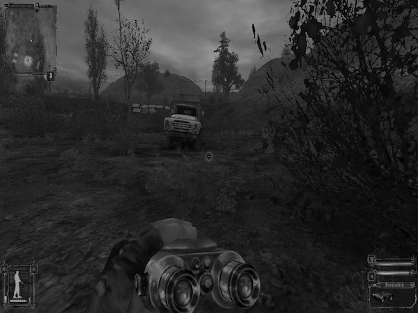
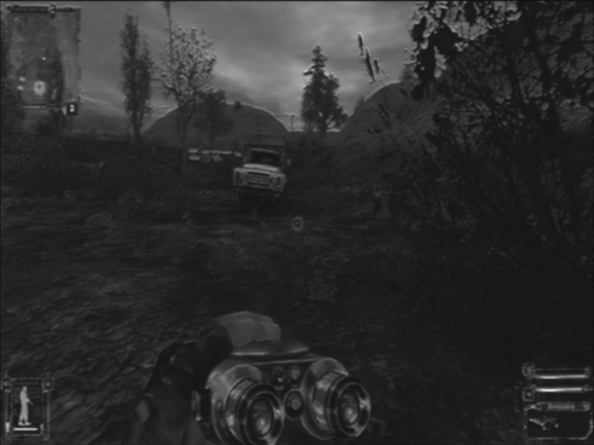
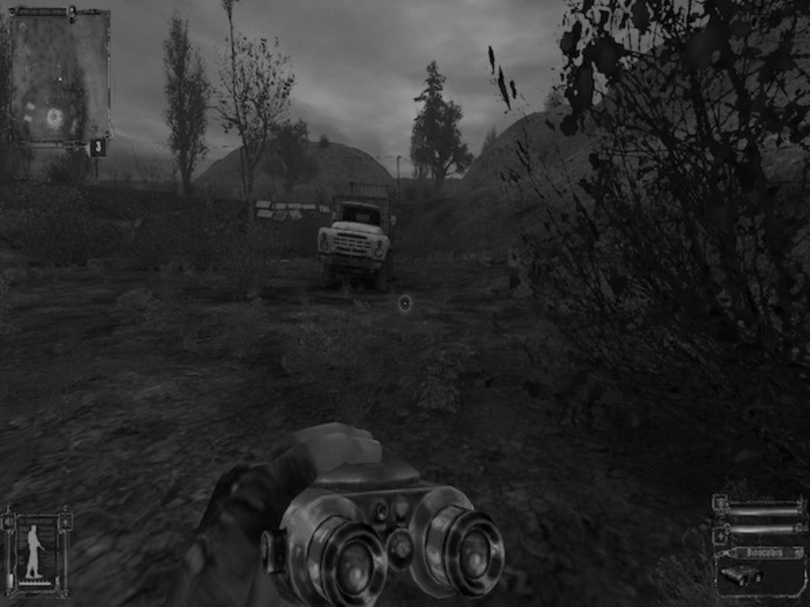

# My attempt in Upscaling with neural networks
Tried to do simplest upscale by upscaling and image and then running convolutions on it.

Here is one example (downscaled, upscaled with nn, just scaled and original)
Pixel diff score between stretched and original image (74.2129)
Pixel diff score between cnn upscaled and original image (73.9671)
(My upscaling performs worse than scaling)

